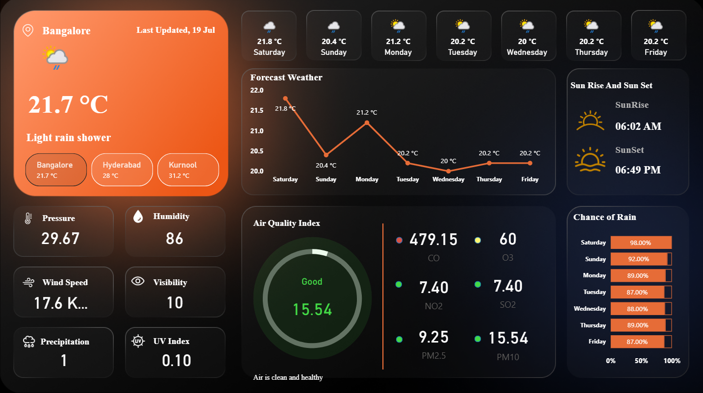

# 🌦️ Weather Dashboard UI

A modern and interactive weather dashboard that displays real-time weather updates, forecast trends, air quality index, and other essential meteorological insights for multiple cities.

## 📸 Preview

## ✨ Features

- **Live Weather Info**: Temperature, conditions, wind speed, humidity, pressure, and more.
- **City Switcher**: Instantly view weather details for Bangalore, Hyderabad, and Kurnool.
- **7-Day Forecast Graph**: Visual line graph showing temperature trends.
- **Air Quality Index (AQI)**: Breakdown of CO, NO2, PM2.5, O3, and more with health status indicator.
- **Chance of Rain**: Horizontal bar chart for weekly rain probability.
- **Sunrise & Sunset Timing**: Clearly displayed timings for each day.
- **Responsive & Stylish UI**: Dark-themed dashboard with clean data cards and consistent visuals.

## 🛠️ Tech Stack

- **Design Tool**: Figma / Canva (or any design software you used)
- **Format**: Static UI mockup (optional for future integration with APIs)
- **File Type**: `.png` export for now (can be extended to HTML/CSS/JS or React)

## 🚀 How to Use

This project currently exists as a static dashboard mockup. You can:

- Showcase it in your design portfolio.
- Use it as a base UI for a real-time weather web app using open APIs like [OpenWeatherMap](https://openweathermap.org/api).
- Rebuild the UI in HTML/CSS or any frontend framework (React, Vue, etc.)

## 📁 File Structure

- `dashboard_screenshot.png` – Visual overview of the report
- `README.md` – This documentation

## 🧠 Tools Used

- Microsoft Power BI
- DAX for calculated metrics
- Business Intelligence design thinking
- Custom visual formatting

## ✅ Future Improvements

- Integrate with live weather APIs for dynamic updates.
- Add search functionality for custom cities.
- Enhance mobile responsiveness.
- Include more data visuals like wind direction and rainfall charts.
  

## 🔗 How to Use

1. Download the `.pbix` file and open in Power BI Desktop.
2. Explore filters and tooltips for full interactivity.
3. Connect to your own sales dataset to repurpose this layout.

## 🧾 Author

**Shaik Roshan Basha**  
[LinkedIn](https://www.linkedin.com/in/roshan-shaik0337/) | [Email](mailto:roshanshaik378@gmail.com)

Feel free to fork, customize, and build on top of this dashboard!
